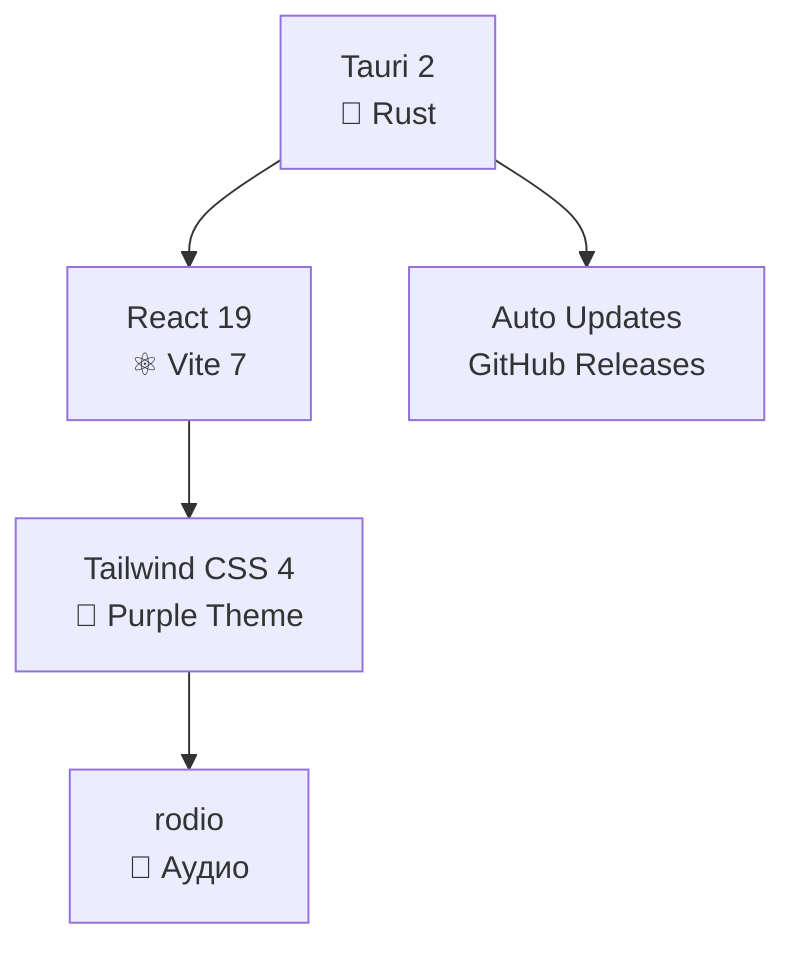

<p align="center">
  <a href="https://github.com/cursedacad3my/NeoCloud-Desktop/releases">
    
  </a>
</p>

# NeoCloud-Desktop
<div align="center">
  
[](https://github.com/cursedacad3my/NeoCloud-Desktop/releases)
[](https://github.com/cursedacad3my/NeoCloud-Desktop/stargazers)
[](https://github.com/cursedacad3my/NeoCloud-Desktop/issues)

**🖤 Фиолетово-черный SoundCloud клиент для России**  
*Без рекламы · Без капчи · Стильный дизайн · Нативное Tauri 2 приложение*

</div>

<div align="center">
  <a href="https://github.com/cursedacad3my/NeoCloud-Desktop/releases">
    
  </a>
  &nbsp;
  
  &nbsp;
  <a href="https://github.com/zxcloli666/SoundCloud-Desktop">
    
  </a>
</div>

<br>

## ✨ Что такого особенного в NeoCloud?

**NeoCloud-Desktop** — это **фиолетово-черный** форк популярного SoundCloud Desktop с акцентом на стиль и производительность.

| 🎨 **Дизайн** | 🛡️ **Функционал** | ⚡ **Производительность** |
|---------------|-------------------|--------------------------|
| Фиолетово-черная тема | Работает в России | ~15 МБ установщик |
| Плавные анимации | Без рекламы/капчи | 80-120 МБ RAM |
| Современный UI | Discord Rich Presence | 60 FPS на слабом ПК |

---

## 📱 Скриншоты (Coming Soon)

<div align="center">
  <table>
    <tr>
      <td align="center">
        
        <p><b>Главная страница</b></p>
      </td>
      <td align="center">
        
        <p><b>Плеер</b></p>
      </td>
    </tr>
    <tr>
      <td align="center">
        
        <p><b>Лайкнутые треки</b></p>
      </td>
      <td align="center">
        
        <p><b>Настройки темы</b></p>
      </td>
    </tr>
  </table>
</div>

<div align="center">
  <i>🎉 Скриншоты реальной версии появятся в первом релизе!</i>
</div>

---

## 🚀 Скачать (Скоро!)

**Активно разрабатывается** — первый релиз на днях!

| ОС | Форматы |
|----|---------|
| **Windows 10/11** | `.exe` (рекомендуется), `.msi` |
| **Linux** | `.deb`, `.rpm`, `.AppImage`, `.flatpak` |
| **macOS** | `.dmg` (Apple Silicon / Intel) |

**[→ Отслеживать релизы](https://github.com/cursedacad3my/NeoCloud-Desktop/releases)**

---

## 🛠 Быстрая сборка

```bash
git clone https://github.com/cursedacad3my/NeoCloud-Desktop.git
cd NeoCloud-Desktop/desktop
pnpm install
pnpm tauri dev  # 🚀 Запуск dev сервера
```

**Требования:**
```bash
Node.js 22+  pnpm 10+  Rust 1.77+
```

---

## 💜 Наш стек



---

---

## 💬 Обратная связь

<div align="center">

| 💡 **Идея** | 🐛 **Баг** | ⭐ **Поддержка** |
|-------------|------------|-----------------|
| [Создать Discussions](https://github.com/cursedacad3my/NeoCloud-Desktop/discussions/new?category=ideas) | [Открыть Issue](https://github.com/cursedacad3my/NeoCloud-Desktop/issues/new) | **Поставь ⭐ прямо сейчас!** |

</div>

---

## 🔗 Ссылки

- **Оригинал:** [zxcloli666/SoundCloud-Desktop](https://github.com/zxcloli666/SoundCloud-Desktop)
- **Релизы:** [cursedacad3my/NeoCloud-Desktop/releases](https://github.com/cursedacad3my/NeoCloud-Desktop/releases)

---

## 📄 Лицензия

[](LICENSE)

**NeoCloud-Desktop** — независимый проект, не связанный с SoundCloud Ltd.

---

<div align="center">

[](https://github.com/cursedacad3my/NeoCloud-Desktop/releases)
[](https://github.com/cursedacad3my/NeoCloud-Desktop/stargazers)

**`neocloud` `neocloud-desktop` `soundcloud` `purple-theme` `music-player` `tauri` `react`**

</div>
